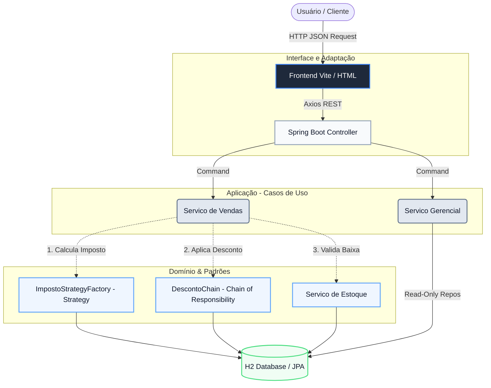

# 🏢 Sistema Efetiva Orçamento 

Um ecossistema comercial unificado focado em alta disponibilidade, coesão estrutural (Clean Architecture) e rica experiência ao usuário. Este projeto estende a base didática inicial do sistema de vendas incorporando práticas corporativas avançadas.

## 🚀 Arquitetura Geral (Clean Architecture)

A execução principal abstrai a dependência do framework e regras operacionais. A imagem mental do tráfego interno dos nossos Casos de Uso atua da seguinte forma:



## 🛠 Padrões de Projeto Utilizados

- **`Strategy Pattern`**: Utilizado para gerir de forma coesa a cobrança de impostos que variam de acordo com a unidade federativa (RS, SP, PE). Isso elimina `if/else` complexos e respeita o *Open-Closed Principle*.
- **`Chain Of Responsibility`**: As regras de descontos (seja por volume ou quantidade individual) se somam cumulativamente através de uma cadeia transparente e de fácil auditoria.
- **`Repository Data Pattern`**: O acesso às camadas base (Estoque, Produto e Orçamento) é feito abstraindo o banco H2 com as interfaces do Spring Data JPA.

## 📂 Organização do Projeto

A solução foi separada nestes pólos de entrega:

1. **`Backend` (Spring Boot 3 + Java 17+)**
   - Roda embarcado na porta `8080`.
   - Popula sozinho o catálogo de produtos e estoques iniciais no H2 local (Database Seed).
   - Gerencia os dados e dispõe das Consultas Exigidas de Relatório de Gerencia.

2. **`Frontend` (React + Vite)**
   - Roda via NodeJS na porta `5173`.
   - Adota **Glassmorphism**, contrastes em Dark Mode e componentes dinâmicos para a navegação suave do carrinho e checkout da venda.

## 🖥️ Como inicializar a Solução

**Passo 1: Levantar a API (Backend)**
Navegue pelo seu terminal ou IDE (IntelliJ/VSCode/Eclipse) até essa mesma pasta onde se encontra este arquivo `readme.md` e rode:
```bash
./mvnw spring-boot:run
```

**Passo 2: Levantar o Portal (Frontend)**
Em outro terminal paralelo, desça até a pasta que contém o `package.json` do frontend (`/frontend`) e baixe as dependências instantâneas:
```bash
npm install
npm run dev
```

Abra a porta disposta no log (geralmente `http://localhost:5173/`) e navegue como um cliente e como um gestor no painel Gerencial.

---
**Nota Avaliativa:** Relatórios, regras de expiração (21 dias) e controle transacional durante o disparo de *Efetivar Orçamentos* estão integralmente automatizados.